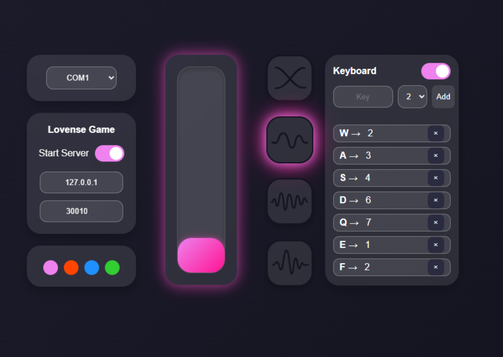

[English](README.md) | [Русский](README.ru.md)

# LoveSpouse|Buttplug.io — Control of Chinese Sex Toys via ESP32

The **LS-Buttplug** project is designed to control the vibrations of cheap Chinese sex toys that work with the **MuSe / Love Spouse** app.
The goal of the project is to expand the functionality of available devices, as most cheap toys have limited firmware, and the **Love Spouse** app works with restrictions and glitches in some regions.

The project supports 4 operation modes and provides smooth control of intensity from 0-7, limited by the device firmware.

---

## 

## ⚙️ Features

* **Manual smooth control** via a local web interface
* **PC game support** with direct connection to Lovense
* **Compatible with [Buttplug.io](https://buttplug.io) / [Intiface Central](https://intiface.com/)** on both PC and mobile devices
* **Supports [XToys.App](https://xtoys.app)**

---

## 🛠 Installation and Setup

### 1. Preparing the ESP32

1. Download the `.zip` archive from the repository and unpack it on your PC.
2. Flashing the ESP32:

**PlatformIO**

* Open the `PlatformIO` folder in PlatformIO
* Select your board in `platformio.ini` or add a new one

**esptool.py**

* Install `esptool`:

  ```bash
  pip install esptool
  ```
* Navigate to your board folder:

  ```bash
  cd ESP/ESP32
  ```
* Flash the board (replace COM1 with your port):

  ```bash
  esptool --chip auto --port COM1 --baud 460800 write_flash -z \
  0x1000 bootloader.bin \
  0x8000 partitions.bin \
  0x10000 firmware.bin
  ```

**If you don’t have Python, you can flash via Flasher.exe**

* Connect the board to your PC
* Run `ESP-Flashing.exe`
* The board will be flashed automatically

### 2. Running LS\_Buttplug

1. Launch `LS-Buttplug.exe` or `LS-Buttplug.py`

   * The web page will open automatically, or go to [http://localhost:5000](http://localhost:5000)
2. Select the COM port connected to your ESP32
3. Control:

   * Using the slider or mouse wheel
   * 4 random vibration modes
4. Enable **Lovense Game** for direct game support

   * In the game settings, go to the **Lovense** section
   * Set HOST: `127.0.0.1`, PORT: `30010` (or matching Web UI settings)
   * Uncheck "SSL Connection" (if available)
   * Click "Connect / Test Connection"
   * Enjoy

### 3. Intiface Central


* No need to run `LS-Buttplug.py`/`LS-Buttplug.exe`
* Start Intiface Central on PC or mobile and scan for devices — your device will be detected as Lovense
* Start a game or app that supports Buttplug.io
* Enjoy control

### 4. XToys.App

* No need to run `LS-Buttplug.py`/`LS-Buttplug.exe`
* Select any Lovense Vibrator device
* Connect and enjoy

---

## 🎮 Tested in games

### Direct Lovense connection

* **Helping the Hotties**
* **Innocent Witches**

### Intiface Central (ver. 2.6.7)

* **Stardew Valley** — [Buttplug Valley (GitHub)](https://github.com/DryIcedTea/Buttplug-Valley) | [Nexus Mods](https://www.nexusmods.com/stardewvalley/mods/19336)
* **Terraria** — [Viberaria (GitHub)](https://github.com/notasuka/Viberaria)
* **Celeste** — [CelestePlug (GameBanana)](https://gamebanana.com/mods/554604)
* **Minecraft** — [Minegasm (Official Site)](https://www.minegasm.net/) | [GitHub](https://github.com/RainbowVille/minegasm)

> ⚠️ There may be errors in Intiface Central when connecting the device, but they do not affect device operation.
> ⚠️ Small vibration delays are possible when using Intiface Central.

---

## 🚀 Future Plans

* Support for dual-channel devices (vibration/rotation, vibration/color)
* ESP32 flashing via Web interface
* .bin firmware files for ESP32s2/3 (you can flash/build yourself using PlatformIO)
* Extended patterns or recording/playback
* Binding vibrations to keyboard keys (e.g., W\.A.S.D for game variety)
* Scheduled vibrations

---

## 💡 Support & Contact

If you have questions or suggestions, you can contact me:

* 📧 Email: [miha.shym@icloud.com](mailto:miha.shym@icloud.com)
* Please include `LS-Buttplug` in the subject line

If you like the project and want to support its development:

* ☕ BTC: `1KhWiRJhniWBgFffaZkWk7EXuLrK1qjN35`
* ☕ USDT (TRC20): `TBG5q6y9f8EE7p8e9naaQKP2UgvjJD5tLT`
* ☕ TON: `UQC-FEFn0TojwtGXogMJrnde7TZtJyNZNGa5awliEl03_off`

---

## 📄 License

MIT License © 2025
