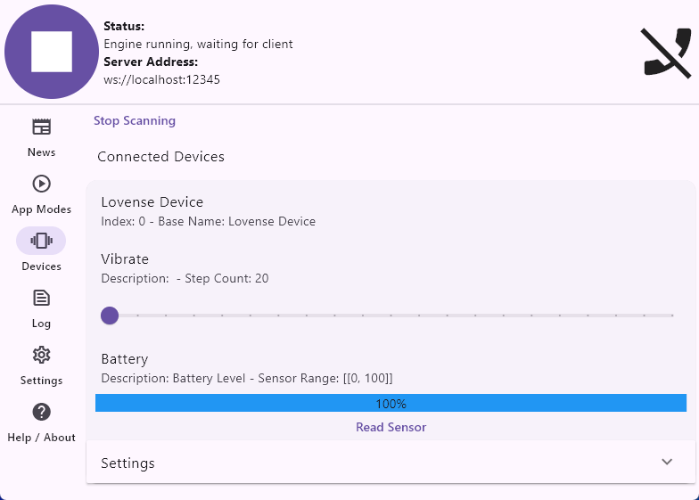

[English](README.md) | [Русский](README.ru.md)


# LoveSpouse|Buttplug.io — Control of Chinese Toys Vibrations via ESP32

The **LS-Buttplug** project is designed to control vibrations of cheap Chinese sex toys that work with the **MuSe / Love Spouse** app.  
The goal of the project is to expand the functionality of available devices, since most cheap toys have limited software, and the **Love Spouse** app works with restrictions and failures in some regions.

The project supports 4 operation modes and provides smooth power control 0-7, which is limited by the device firmware.

---

---

## ⚙️ Features

- **Manual smooth control** via local Web interface  
- **Support for Lovense games on PC**  
- **Compatibility with [Buttplug.io](https://buttplug.io) / [Intiface Central](https://intiface.com/)** on both PC and mobile devices  
- **Support for [XToys.App](https://xtoys.app)**  

---

## 🛠 Installation and Setup

### 1. Preparing ESP32  
# Go to [Releases](https://github.com/Fi0nee/LS-Buttplug/releases) and download the latest version

> ⚠️ **Note about antivirus false positive**  
> Some antivirus programs (including Windows Defender) may incorrectly flag `LS-Buttplug.zip` or `LS-Buttplug.exe` as a virus.  
> This is a **false positive** caused by the packaging method used to bundle the executable.  
> The files are safe to use — you can verify by building the project yourself from the source code.

1. Download the `.zip` archive and unpack it on your PC.  
2. Flash the ESP32:  

**PlatformIO**  
- Open the `PlatformIO` folder in PlatformIO  
- Select your board in platformio.ini or add a new one  

**esptool.py**  
- Install `esptool`:
  ```bash
  pip install esptool
  ```
- Select the folder for your board:
   ```bash
   cd ESP/ESP32
   ```
- Flash (replace COM1 with your port):
   ```bash
   esptool --chip auto --port COM1 --baud 460800 write_flash -z    0x1000 bootloader.bin    0x8000 partitions.bin    0x10000 firmware.bin
   ```
**If you don’t have Python you can flash using Flasher.exe**  
- Connect the board to your PC  
- Run `ESP-Flashing.exe`  
- The board will be flashed automatically  

### 2. Running LS_Buttplug
1. Run `LS-Buttplug.exe` or `LS-Buttplug.py`  
   - A Web page will open automatically or go to [http://localhost:5000](http://localhost:5000)  
2. Select the COM port where your ESP32 is connected  
3. Control:  
   - With mouse slider or scroll wheel  
   - 4 random vibration modes  
4. Enable **Lovense Game** for direct game support  
    - In game settings go to **Lovense**  
    - Set HOST: `127.0.0.1`, PORT: `30010` (or others matching Web interface)  
    - Uncheck "Connect via SSL" (if available)  
    - Press "Connect / Test Connection"  
    - Enjoy  
5. Enable **Keyboard** to bind vibrations to keyboard keys  
    - Enter any symbol in Key field — assign vibration level and press Add  
    - Add as many symbols as you want  
    - You can assign vibration level to each keyboard key separately  
    - Type text — enjoy  
    - Play any games without Lovense/Buttplug.io/Intiface Central support  
    - Works system-wide on Windows  
    > ⚠️ No support for F1-F12, space, enter, and other system keys  

### 3. Intiface Central

- Running `LS-Buttplug.py`/`LS-Buttplug.exe` is not required  
- Launch Intiface Central on PC or mobile and scan for devices — the device will appear as Lovense  
- Run a game or app with Buttplug.io support  
- Enjoy control  

### 4. XToys.App
- Running `LS-Buttplug.py`/`LS-Buttplug.exe` is not required  
- Choose any Lovense Vibrator device  
- Connect and enjoy  

---

## 🎮 Tested in Games

### Direct Lovense Connection
- **Helping the Hotties**  
- **Innocent Witches**  

### Intiface Central (ver. 2.6.7)
- **Stardew Valley** — [Buttplug Valley (GitHub)](https://github.com/DryIcedTea/Buttplug-Valley) | [Nexus Mods](https://www.nexusmods.com/stardewvalley/mods/19336)  
- **Terraria** — [Viberaria (GitHub)](https://github.com/notasuka/Viberaria)  
- **Celeste** — [CelestePlug (GameBanana)](https://gamebanana.com/mods/554604)  
- **Minecraft** — [Minegasm (official site)](https://www.minegasm.net/) | [GitHub](https://github.com/RainbowVille/minegasm)  

---

## ⚠️ Issues and Notes
- There are errors in Intiface Central when connecting the device, but they do not affect functionality.  
- Small vibration delays may occur when working with Intiface Central.  
- Works with Lovense Remote app only on Android in offline mode. Sometimes works online only if you first disable internet — connect the device — then enable internet. Your toy may be disconnected at any time.  
- On iOS the toy is not detected.  

---

## 🚀 Future Plans
- Support for dual-channel devices (vibration/rotation, vibration/color)  
- ESP32 flashing via Web interface  
- .bin firmware files for ESP32s2/3 (You can flash/build yourself using PlatformIO)  
- Extended patterns or record/playback  
- Scheduled vibration  

---

## 💡 Support and Feedback

If you have any questions or suggestions, you can contact me:  
- 📧 Email: [miha.shym@icloud.com](mailto:miha.shym@icloud.com)  
- Please include in subject: `LS-Buttplug`  

If you like the project and want to support development:  
- ☕BTC: `1KhWiRJhniWBgFffaZkWk7EXuLrK1qjN35`  
- ☕USDT (TRC20): `TBG5q6y9f8EE7p8e9naaQKP2UgvjJD5tLT`  
- ☕TON: `UQC-FEFn0TojwtGXogMJrnde7TZtJyNZNGa5awliEl03_off`  

---

## 📄 License
MIT License © 2025
