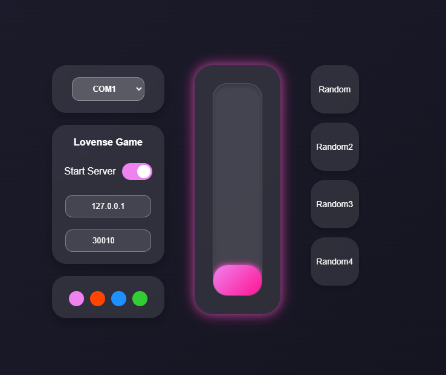
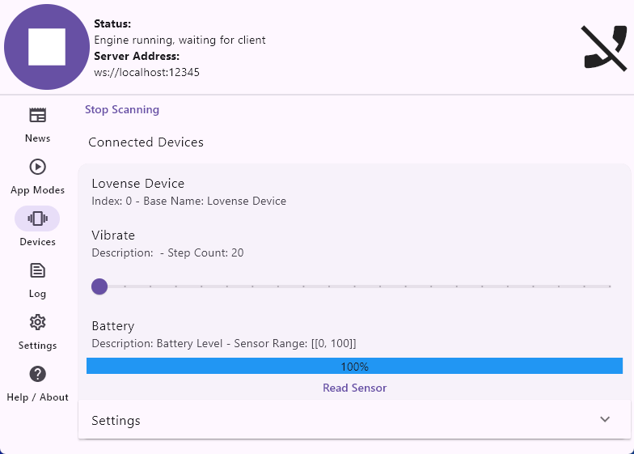

<h1 align="center">LS-Buttplug</h1>
<p align="center">
  Управление вибрациями китайских игрушек MuSe / Love Spouse через ESP32
</p>

<p align="center">
  <a href="https://github.com/Fi0nee/LS-Buttplug/releases">
    
  </a>
</p>

<p align="center">
   <a href="README.md"></a>
   <a href="README.ru.md"></a>
</p>

Проект **LS-Buttplug** предназначен для управления вибрациями дешевых китайских секс-игрушек, которые работают с приложением **MuSe / Love Spouse**.  
Цель проекта — расширить функционал доступных устройств, поскольку большинство дешевых игрушек имеют ограниченное ПО, а приложение **Love Spouse** работает с ограничениями и сбоими в некоторых регионах.

Проект поддерживает 4 режима работы и обеспечивает плавное управление мощностью 0-9.

---

---

## ⚙️ Особенности

- **Ручное плавное управление** через локальный Web-интерфейс  
- **Поддержка Lovense игр на ПК**
- **Совместимость с [Buttplug.io](https://buttplug.io) / [Intiface Central](https://intiface.com/)** как на ПК так и мобильных устройствах
- **Поддержка [XToys.App](https://xtoys.app)** 
- **Поддержка Lovense Remote (ограничено)**

---

## 🛠 Установка и настройка

### 1. Подготовка ESP32  

1. Скачайте`.zip` архив и распакуйте его на ПК.  
2. Прошивка ESP32:  

**PlatformIO**  
- Откройте папку `PlatformIO` в PlatformIO
- Выберите вашу плату в platformio.ini или добавьте новую
- Прошейте ESP32

### 2. Запуск LS-Buttplug

```bash
pip install -r requirements.txt
```

1. Запустите `LS-Buttplug.py`
   - Автоматически откроется Web-страница или перейдите по ссылке [http://localhost:5000](http://localhost:5000)  
2. Выберите COM-порт, к которому подключена плата ESP32  
3. Управление:
   - Слайдером мышью или колесиком  
   - 4 режима случайных вибраций
4. Включите **Lovense Game** для подключения игр с прямой поддержкой
    - В настройках игры перейдите в раздел **Lovense**  
    - Укажите HOST: `127.0.0.1`, PORT: `30010` (или другие, совпадающие с Web-интерфейсом)  
    - Снимите галочку "Подключение по SSL" (если есть)  
    - Нажмите "Подключить / Тест подключения"
    - Наслаждайтесь  
5. Включите **Keyboard** для привязки вибраций к клавиатуре
    - Введите в поле Key любой символ - назначьте уровень вибрации и нажмите Add
    - Добавляйте сколько угодно символов
    - Можно назначить уровень вибрации для каждой кнопки на клавиатуре в отдельности
    - Печатайте текст - наслаждайтесь
    - Играете в любые игры без поддержки устройств Lovense/Buttplug.io/Intiface Central
    - Работает во всей системе Windows
    > ⚠️ Без поддержки F1-F12, space, enter, и других системных клавиш

### 3. Intiface Central

- Запускать `LS-Buttplug.py` не нужно
- Запустите Intiface Central на ПК или мобильном устройстве и выполните сканирование устройств — устройство будет обнаружено как Lovense  
- Запустите игру или приложение с поддержкой Buttplug.io  
- Наслаждайтесь управлением  

### 4. XToys.App
- Запускать `LS-Buttplug.py` не нужно
- Выберите дюбое устройство Lovense Vibrator
- Подключитесь и наслаждайтесь

---

## 🎮 Протестировано в играх:

### Прямое подключение Lovense
- **Helping the Hotties**  
- **Innocent Witches**  

### Intiface Central (ver. 2.6.8)
- **Stardew Valley** — [Buttplug Valley (GitHub)](https://github.com/DryIcedTea/Buttplug-Valley) | [Nexus Mods](https://www.nexusmods.com/stardewvalley/mods/19336)  
- **Terraria** — [Viberaria (GitHub)](https://github.com/notasuka/Viberaria)  
- **Celeste** — [CelestePlug (GameBanana)](https://gamebanana.com/mods/554604)  
- **Minecraft** — [Minegasm (официальный сайт)](https://www.minegasm.net/) | [GitHub](https://github.com/RainbowVille/minegasm)  

---

## ⚠️Ошибки и примечания
- Возможны небольшие задержки вибраций при работе с Intiface Central.
- Работает с приложением Lovense Remote в оффлайн режиме Иногда работает и онлайн, только если сначала выключите интернет - подключите устройство - затем включите интернет. Вашу игрушку могут отключить в любой момент.

- Если устройство не реагирует на команды, воспользуйтесь дополнительной прошивкой для подбора HEX [BLE-HEX-Picker](https://github.com/Fi0nee/BLE-HEX-Picker)

---

## 🚀 Планы на будущее
- Поддержка двухканальных устройств (вибрация/ротация, вибрация/цвет)
- Прошивка ESP32 через Web-интерфейс
- Расширеные паттерны или запись/воспроизведение
- Вибрация по расписанию

---

## 💡 Поддержка и обратная связь

Если у вас возникли вопросы или предложения, вы можете связаться со мной:
- 📧 Email: [miha.shym@icloud.com](mailto:miha.shym@icloud.com)  
- Обязательно указжите в теме: `LS-Buttplug`

Если вам нравится проект — поддержите его ⭐

---
